<p align="center">
  <a href="https://spectroscope.ai">
    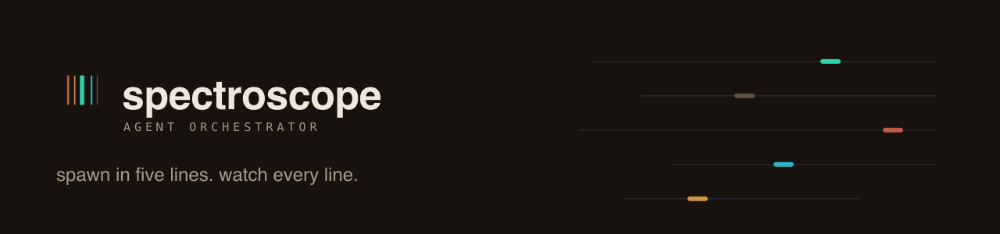
  </a>
</p>

<p align="center">
  <em>the agent orchestrator you can watch. every event is like a spectral line, every agent a lane on the screen.</em>
</p>

<p align="center">
  <a href="https://github.com/spectroscope/spectroscope/actions/workflows/gate.yml"></a>
  <a href="https://central.sonatype.com/artifact/dev.spectroscope/spectro-core"></a>
  <a href="https://github.com/spectroscope/spectroscope/releases"></a>
  <a href="LICENSE"></a>
  <a href="LICENSE-ASSETS.md"></a>
  <a href="https://github.com/spectroscope/spectroscope/releases/latest"></a>
  
</p>

<p align="center">
  <a href="https://spectroscope.ai">website</a> ·
  <a href="https://spectroscope.ai/guide/">user guide</a> ·
  <a href="https://spectroscope.dev">dev docs</a> ·
  <a href="https://gallery.spectroscope.ai">gallery</a> ·
  <a href="https://github.com/spectroscope/spectroscope/releases">releases</a> ·
  <a href="release-notes/">release notes</a>
</p>

<picture>
  <source media="(prefers-color-scheme: dark)" srcset="docs/guide-assets/shots/20-spectrum-brand.png">
  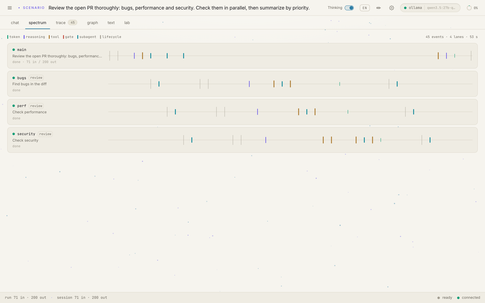
</picture>
<p align="center"><sub><b>the spectrum</b> · four agents review a pull request in parallel; every event is a tick on its agent's lane</sub></p>

## watch deeper

spectroscope is a JVM agent harness and fleet orchestrator. One Java core drives
every face: a terminal REPL, headless runs, a Spring Boot web UI, a signed macOS
desktop app, an MCP example server, and a fleet of agents on a shared bus.

Everything an agent does lands in one stream of typed JSONL `RunEvent`s, the
same wire format on every face. The UI reads that stream the way a spectroscope
reads light: watch it live, store it as plain files, replay it step by step,
lens it for reasoning and timing, and answer permission gates while the run
waits. There is no separate telemetry stack to deploy; the session file is the
record.

spectroscope began as the reference harness of a build-an-agent-harness
workshop and grew into its own product.

## five lines to an agent

```java
var agent = Spectro.agent()
    .model(Anthropic.opus())
    .tools(Tools.readFile(), Tools.runCommand())
    .workspace(Path.of("/tmp/scratch"));

for (RunEvent event : agent.run("Write hello.py and run it")) {
    System.out.println(event);   // the stream IS the observability
}
```

The same style scales to a fleet: `Spectro.panel()` runs several lanes as full
agents on a shared bus and hands you one merged event stream. Both artifacts
are on Maven Central:

```kotlin
implementation("dev.spectroscope:spectro-core:0.11.0")
implementation("dev.spectroscope:spectro-orchestrator:0.11.0")   // fleets
```

## the tour

<table>
  <tr>
    <td width="50%">
      <picture>
        <source media="(prefers-color-scheme: dark)" srcset="docs/guide-assets/shots/21-trace-lens-brand.png">
        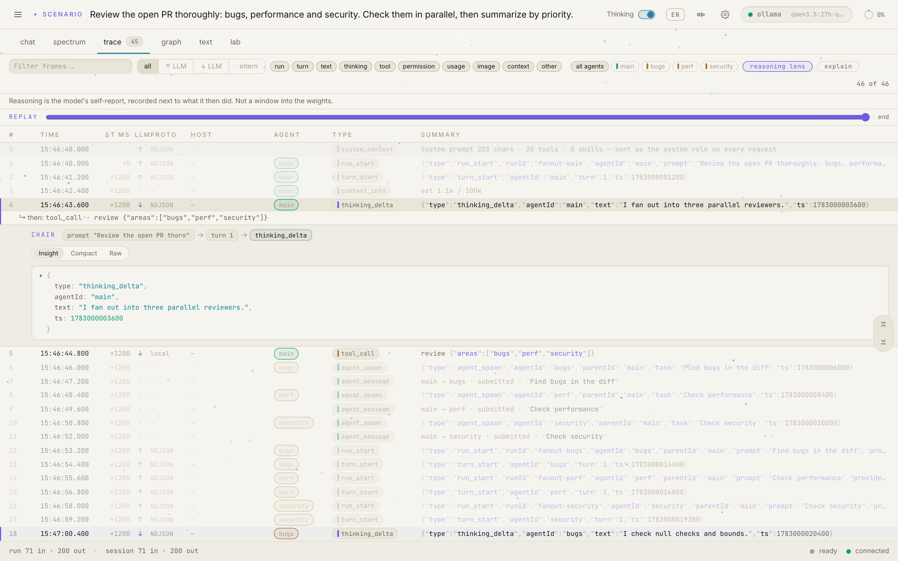
      </picture>
      <br><sub><b>the trace</b> · every frame with its causal chain, a reasoning lens, and a replay scrubber</sub>
    </td>
    <td width="50%">
      <picture>
        <source media="(prefers-color-scheme: dark)" srcset="docs/guide-assets/shots/23-permission-dialog.png">
        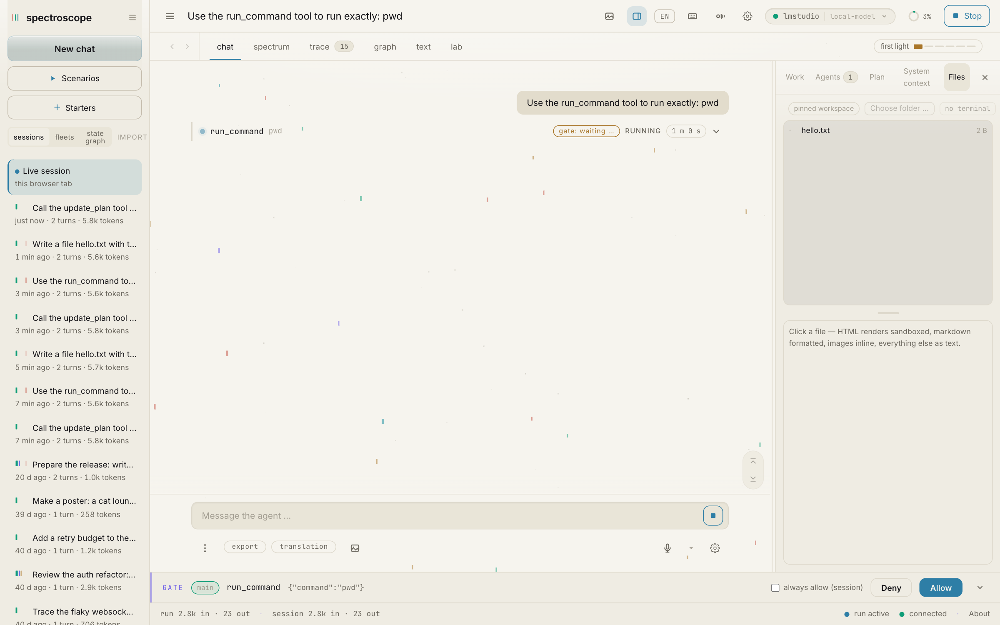
      </picture>
      <br><sub><b>the gate</b> · writes and commands wait for allow or deny; every decision lands in the stream</sub>
    </td>
  </tr>
  <tr>
    <td width="50%">
      <picture>
        <source media="(prefers-color-scheme: dark)" srcset="docs/guide-assets/shots/27-fleet-canvas.png">
        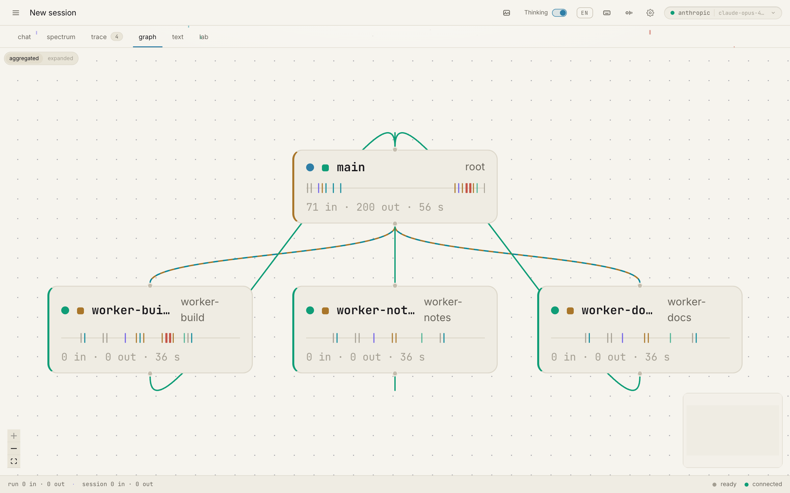
      </picture>
      <br><sub><b>the fleet canvas</b> · spawn edges and per-node spectral lines, live from the bus</sub>
    </td>
    <td width="50%">
      <picture>
        <source media="(prefers-color-scheme: dark)" srcset="docs/guide-assets/shots/28-fleet-machine-room.png">
        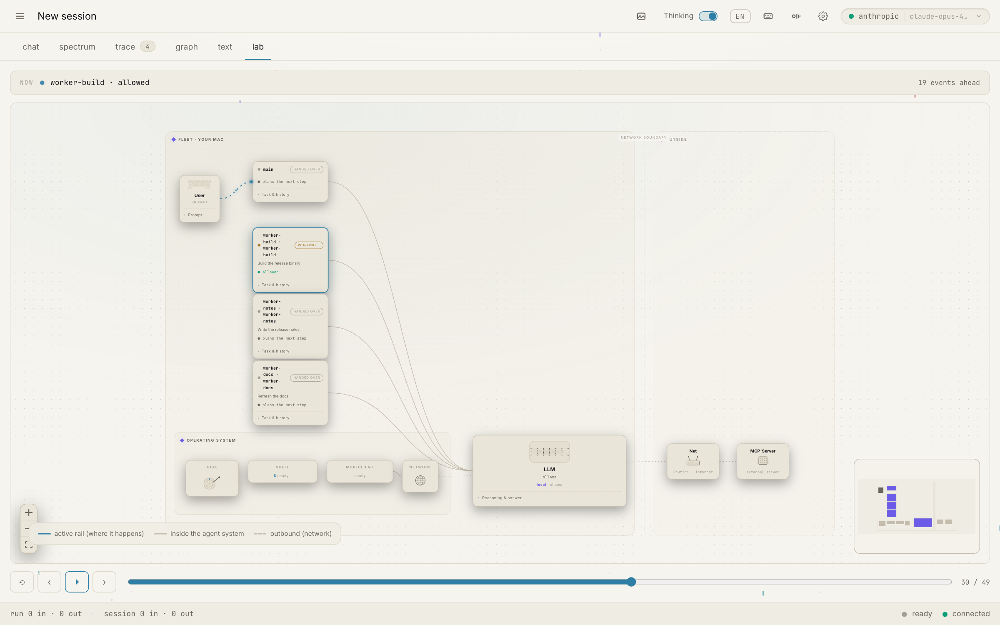
      </picture>
      <br><sub><b>the machine room</b> · a running fleet as one composed system diagram, scrubbable in time</sub>
    </td>
  </tr>
  <tr>
    <td width="50%">
      <picture>
        <source media="(prefers-color-scheme: dark)" srcset="docs/guide-assets/shots/22-thinking-live.png">
        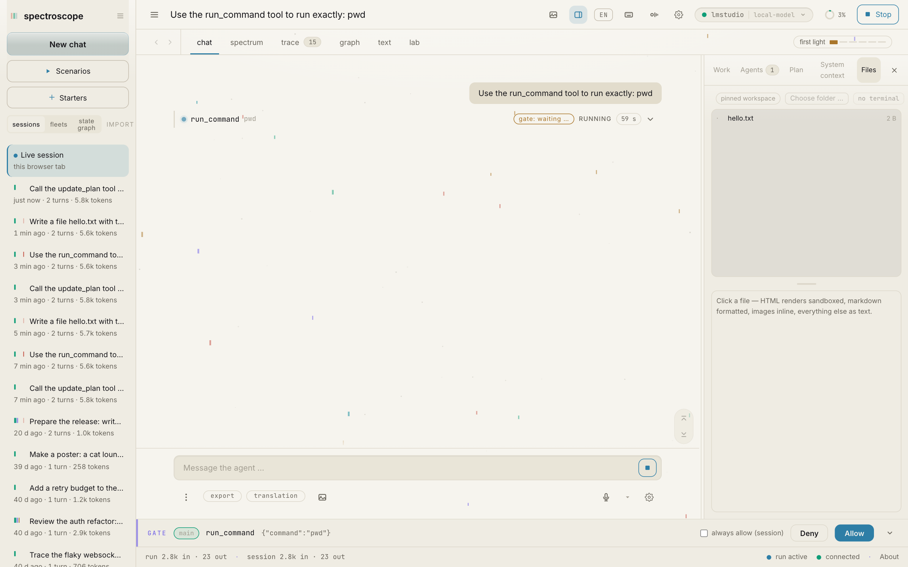
      </picture>
      <br><sub><b>thinking, live</b> · the model's self-report streams next to what it then did</sub>
    </td>
    <td width="50%">
      <picture>
        <source media="(prefers-color-scheme: dark)" srcset="docs/guide-assets/shots/30-text-explain.png">
        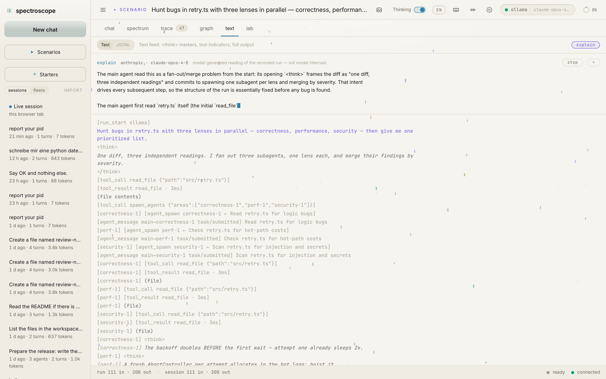
      </picture>
      <br><sub><b>explain</b> · an LLM reading of the whole run, honestly labeled as a reading</sub>
    </td>
  </tr>
  <tr>
    <td width="50%">
      <picture>
        <source media="(prefers-color-scheme: dark)" srcset="docs/guide-assets/shots/33-leveling-intro.png">
        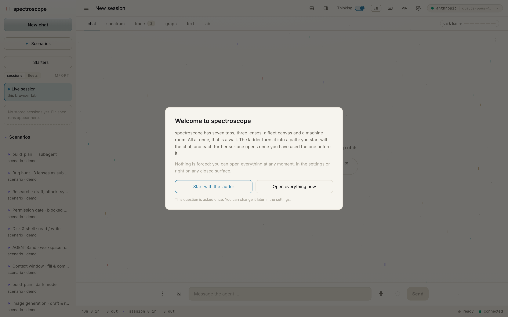
      </picture>
      <br><sub><b>grow into it</b> · a fresh home starts small and asks; an existing home is never asked and never locked</sub>
    </td>
    <td width="50%">
      <picture>
        <source media="(prefers-color-scheme: dark)" srcset="docs/guide-assets/shots/34-leveling-panel.png">
        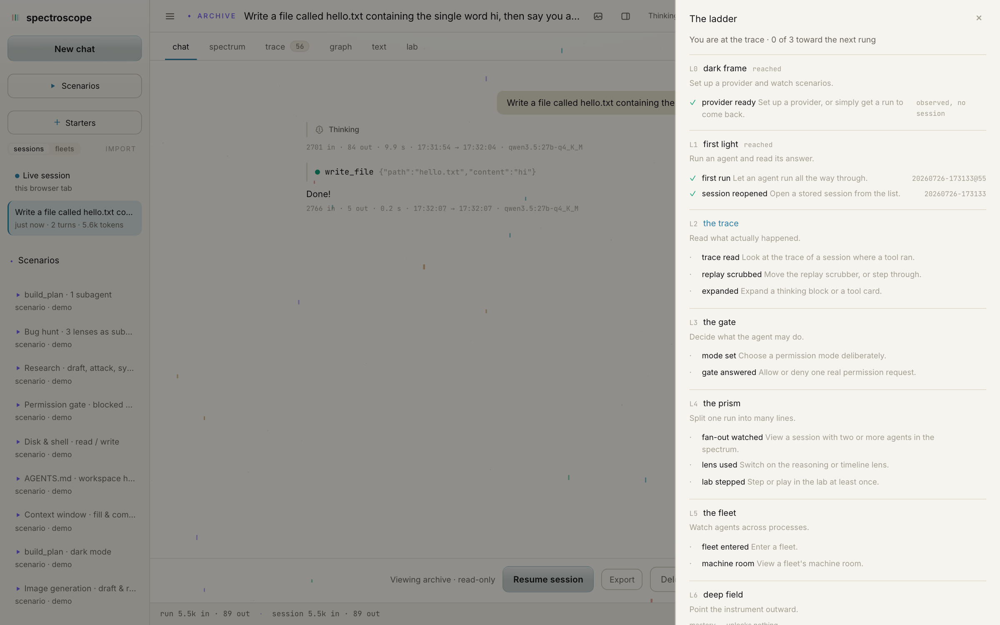
      </picture>
      <br><sub><b>the tutorial</b> · levels tick from observed usage, every tick with a receipt into the session it happened in</sub>
    </td>
  </tr>
  <tr>
    <td width="50%">
      <picture>
        <source media="(prefers-color-scheme: dark)" srcset="docs/guide-assets/shots/42-local-chooser.png">
        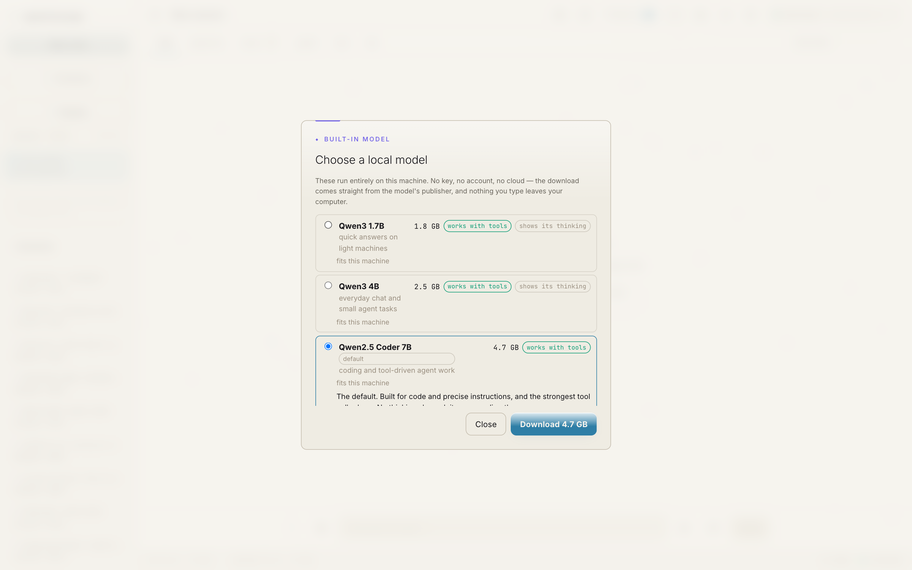
      </picture>
      <br><sub><b>no key, no cloud</b> · pick a local model, see whether your machine holds it, download once — tools included</sub>
    </td>
    <td width="50%"></td>
  </tr>
</table>

More in the [gallery](https://gallery.spectroscope.ai) and the
[user guide](https://spectroscope.ai/guide/), both in light and dark.

## install

Four routes to 0.11.0, each with the platform it covers. Every asset is on the
[release page](https://github.com/spectroscope/spectroscope/releases/latest),
where `SHA256SUMS.linux` covers the two Linux kits.

**Homebrew — macOS on Apple silicon.**

```sh
brew install --cask spectroscope/tap/spectroscope
```

The signed and notarized desktop kit, which brings its own Java runtime and its
own `llama-server`. Uninstalling leaves `~/.spectro` alone: that is where your
sessions live, and the CLI and the server jar share it. Apple silicon only,
there is no Intel build.

**The disk image — macOS on Apple silicon.** `spectroscope-0.11.0-arm64.dmg`
from the release page is the same kit without the tap.

**apt — Debian 12 and Ubuntu 24.04, x86_64.**

```sh
curl -fsSL https://apt.spectroscope.dev/spectroscope.asc | sudo gpg --dearmor -o /usr/share/keyrings/spectroscope.gpg
echo "deb [signed-by=/usr/share/keyrings/spectroscope.gpg] https://apt.spectroscope.dev stable main" | sudo tee /etc/apt/sources.list.d/spectroscope.list
sudo apt update && sudo apt install spectroscope
```

That third line stops twice for an answer, and in a container nobody gives
either one. apt asks you to confirm the download first; answer that, and on a
machine where `tzdata` has never been configured a package several levels down
the dependency chain asks which timezone you live in. Neither question times
out, so an unattended install stops for good: at the first one nothing has been
downloaded at all, at the second the package is unpacked and never configured.
Where no one is at the keyboard, use this instead:

```sh
sudo DEBIAN_FRONTEND=noninteractive apt install -y spectroscope
```

`-y` answers apt's own confirmation and `DEBIAN_FRONTEND=noninteractive`
answers the timezone question, which then settles on `Etc/UTC` without telling
you. That is the right trade in a container and the wrong one on a machine you
are setting up by hand, so it stands next to the three lines rather than
replacing them. Only the Ubuntu half of the pair above is affected: Debian 12
ships `tzdata` already configured, and its `systemd` does not recommend the
Python network dispatcher that drags `tzdata` in on Ubuntu. A full Ubuntu
server or desktop install is fine too, because `tzdata` is priority-important
and configured long before this repository is added. Minimal container images
and chroots are the ones that strip it.

The index is GPG-signed and pinned to that one key with `signed-by`; there is no
`trusted=yes` and no allow-insecure switch. x86_64 only, so on arm64 apt takes
the source and then finds nothing to install. For x86_64 distributions that do
not use apt, `spectroscope-0.11.0-x86_64.AppImage` is the same kit as one file.
Neither Linux kit is signed, because Linux has no equivalent gate to pass. Both
are covered by `SHA256SUMS.linux` on the release page, so the check to run on a
download is:

```sh
sha256sum -c SHA256SUMS.linux --ignore-missing
```

**From source.** Clone this repository and use the `./spectro-app` launcher below.

**Everywhere else — arm64 Linux, Windows, anything with a JVM.** There is no
desktop kit, and no macOS route will help. Take `spectro-0.11.0.zip` (the CLI) or
`spectro-server-0.11.0.jar` and run them on a JDK 21; that is the smallest way
in, and the only way onto a platform with no kit. Two things the kits carry are
missing there: a bundled `llama-server` for the built-in models, which you
supply yourself (`brew install llama.cpp`, or your package manager), and the
`spectro-pty` helper the Files tab terminal needs, which is POSIX-only either
way. The bundled example MCP server ships separately as
`spectro-mcp-notes-0.11.0.zip`.

## run it

The desktop kits open the cockpit themselves. From a clone, the `./spectro-app`
launcher resolves a JDK 21+ for you and loads the gitignored `./.env`:

```bash
./spectro-app web start   # web UI → http://127.0.0.1:8080, in the background
./spectro-app web         # what the web group can do, and whether it is running
./spectro-app repl        # terminal REPL
./spectro-app run -p "…"  # headless run
./spectro-app desktop     # Electron desktop app
./spectro-app doctor      # environment check
./spectro-app tour        # guided feature tour
```

It also knows `node`, `cron`, `sessions`, `resume <id>`, `level` and
`mcp-notes`.

**`./spectro-app` is this repository's developer wrapper; `spectro` is the
shipped CLI.** The two names differ on purpose. What you install from a release
is called `spectro` and always will be — that is the product's command, in every
doc page and every kit. In a clone the wrapper stands beside three siblings, and
naming it after the job rather than after the product is what lets the four
read as a set:

| in the root | what it does |
|---|---|
| [`./spectro-app`](spectro-app) | the developer's way into the product: `repl`, `run`, `web`, `desktop`, `doctor`, `tour` |
| [`./spectro-serve`](spectro-serve) | the server's lifecycle: `start`, `stop`, `restart`, `status`, `logs`, `doctor` |
| [`./spectro-env`](spectro-env) | the docker stacks in [`ci/`](ci/): `up`, `down`, `status`, `logs`, `open`, `doctor` |
| [`./spectro-cockpit`](spectro-cockpit) | the estate overview in [`cockpit/`](cockpit/): one page for stacks, launch configs, servers and fleets |

Raw Gradle works too (JDK 21+ as `JAVA_HOME`):

```bash
./gradlew build                                  # everything + all tests
./gradlew :spectro-server:bootRun                # the web face
(cd spectro-web && npm install && npm run build) # rebuild the UI into the server jar
```

The web build writes into `spectro-server/src/main/resources/static/`, where
the committed bundle lives, so rebuilding it dirties tracked files by design.
Web development wants Node 20+.

## observability, built in

The core has a tracing seam, and two sinks ship with it: the JSONL session
file (always on, the source of truth) and an **OTLP exporter** that maps
sessions to GenAI-semconv spans. Point it at Langfuse, Jaeger, or any OTLP
endpoint under settings, observability; `spectro doctor` probes the endpoint
with an empty batch and tells you whether it answers. Details in
[docs/OBSERVABILITY.md](docs/OBSERVABILITY.md).

## how it is built

<picture>
  <source media="(prefers-color-scheme: dark)" srcset="docs/diagrams/00-one-core-five-faces.svg">
  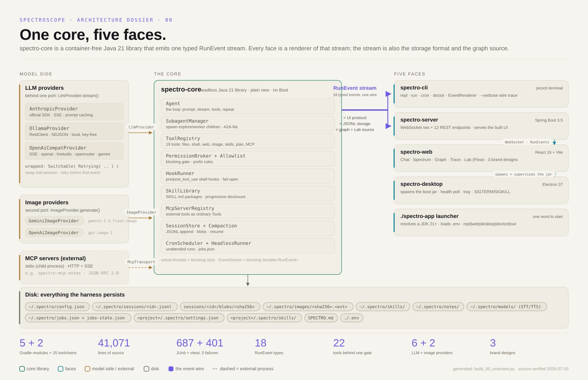
</picture>

| module | what it is |
|---|---|
| `spectro-core` | the agent loop, providers, tools, permission gate, sessions, tracing seam |
| `spectro-cli` | terminal face: REPL, headless runs, doctor, tour, scheduler |
| `spectro-server` | Spring Boot web face: WebSocket stream + REST, serves the built UI |
| `spectro-web` | the React UI (Vite): chat, spectrum, trace, graph, text, lab |
| `spectro-desktop` | Electron shell that spawns and supervises the server jar |
| `spectro-mcp-notes` | bundled example MCP server (notes search/add over stdio) |
| `spectro-orchestrator` | the fleet: lanes as full agents on a shared bus, one merged stream |

Runs on Spring and almost nothing else. Twenty-one hand-built architecture
diagrams live in [docs/diagrams/](docs/diagrams/), each in both themes;
[docs/ARCHITECTURE.md](docs/ARCHITECTURE.md) and
[docs/WEB-UI.md](docs/WEB-UI.md) go deep.

## providers

Eight chat providers, switchable mid-session from the header picker with
history intact:

| provider | runs | needs |
|---|---|---|
| `spectro-local` | local, via llama-server — the picker calls it **built-in** | nothing with the desktop kits, which bundle one; with the server jar, `brew install llama.cpp` |
| `anthropic` | cloud | `ANTHROPIC_API_KEY` |
| `ollama` | local | a running Ollama |
| `openai` | api.openai.com or any compatible server | `OPENAI_API_KEY` (optional for local servers) |
| `lmstudio` | local | LM Studio's server on :1234 |
| `llamacpp` | local | your own `llama-server` on :8080 |
| `openrouter` | cloud | `OPENROUTER_API_KEY` |
| `gemini` | cloud | `GEMINI_API_KEY` |

`lmstudio` and `llamacpp` speak the same wire and are still two ids on purpose: a
llama-server serves the one model it was started with and answers `GET /props`
with the window that model is really loaded at, so `llamacpp` reads the context
window instead of guessing it. Pointing `lmstudio` at a llama-server works and
loses that.

The built-in provider is the no-setup path: the app offers a small catalogue
of open models (Qwen3 1.7B/4B/8B, Qwen2.5 Coder 7B, VibeThinker 3B), says
which of them can drive the agent's tools and whether your machine has the
memory and disk for each, then downloads your pick sha256-pinned — four of
them from Qwen's own repository, VibeThinker from a community requantization
of WeiboAI's model. Each row links its licence and its source. The desktop
kits carry their own `llama-server`, so nothing else needs installing; with the
server jar you bring your own (`brew install llama.cpp`) and the chooser says
so when it is missing. No key and no account, and the model itself runs on
your machine.

Keys are set once, in the UI (masked, written to `~/.spectro/.env` with mode
0600) or via CLI `set-key`; one Gemini or OpenAI key serves chat and the
`generate_image` tool alike. Config layers from env up to per-workspace
settings files; `spectro doctor` names anything shadowed.

Beyond that, the tool belt covers files, shell, sandboxed grep and glob, web
fetch, tiered web search, JS-capable page browsing through the system Chrome,
image generation, subagents, skills, and MCP servers, all behind the same
permission gate.

## tested

The gate on `main` at `a98a3ec`, measured 2026-08-10: **1,589 JUnit tests across
217 result files and 3,177 vitest tests across 204 files**, no failures, with the
build cache and the up-to-date checks disabled — `./gradlew test` goes green
without running anything if you let it.

Named by commit rather than by release on purpose. The numbers this line used to
carry were the v0.5.0 gate, two releases behind what the page above tells you to
download, and a number nobody can date is a number nobody can check.

The suites run without any API key; provider wire mappings
are tested against scripted local servers, and the one live contract check
skips itself unless a key is set. Concurrency suites (bus, hub, fleet) pass
three consecutive runs before a release.

## docs

- [user guide](https://spectroscope.ai/guide/), 120+ pages, HTML and PDF, light and dark editions, real captured screens
- [dev portal](https://spectroscope.dev) with a generated, searchable reference extracted from this source tree
- [samples/](samples/) — eight numbered examples, six of them standalone Gradle projects that resolve spectroscope from Maven Central rather than from this tree: the five lines, a fleet, recording a run for `spectro web`, a fleet across processes, OTel export, and a LangChain4j provider
- [docs/ARCHITECTURE.md](docs/ARCHITECTURE.md), [docs/WEB-UI.md](docs/WEB-UI.md), [docs/OBSERVABILITY.md](docs/OBSERVABILITY.md), [docs/INTEROP.md](docs/INTEROP.md)
- [docs/WEB-BUNDLE.md](docs/WEB-BUNDLE.md) — why the built UI is a tracked file, and the one command that resolves it when two branches collide in it
- [release-notes/](release-notes/) for what each version brought

Found a bug or a rough edge? Open an issue; the project is young and moves
fast.

## license and credit

Two licenses, one rule: the name stays attached.

**Code: [MIT](LICENSE)**, copyright Christopher Ezell. Use it, fork it, ship
it, sell with it; the one thing the license asks is that the copyright notice
travels with copies of the code. Stripping it ends the license.

**Images: [CC BY 4.0](LICENSE-ASSETS.md)** for the screenshots, the
architecture diagrams and the banner. Reuse them in posts, talks, papers or
products, commercially too, as long as visible attribution stays with them:
*"spectroscope — Christopher Ezell, github.com/spectroscope/spectroscope,
CC BY 4.0"*. The spectroscope logo and wordmark are the exception: fine for
referring to the project, not for branding something else —
[LICENSE-ASSETS.md](LICENSE-ASSETS.md) has the exact terms.

If spectroscope shows up in your product or your research, a mention with a
link back is very welcome. GitHub reads [CITATION.cff](CITATION.cff),
so "cite this repository" in the sidebar gives you a ready-made reference.
