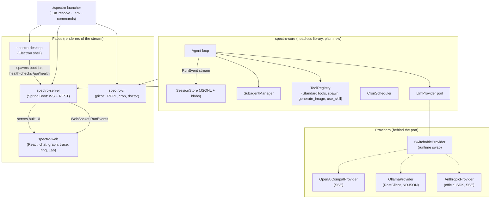
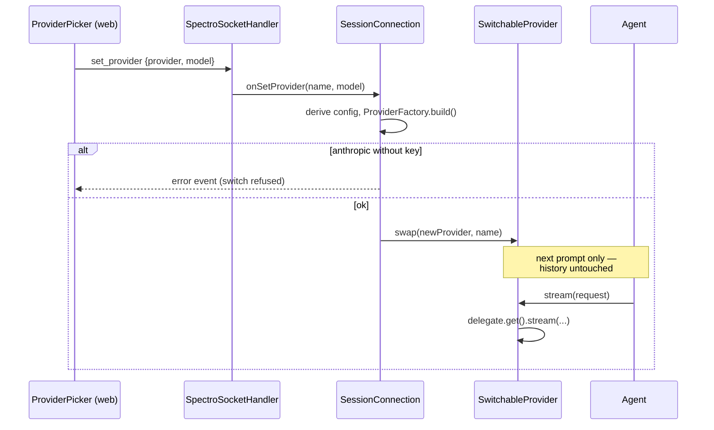
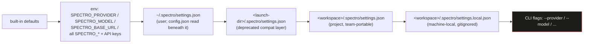
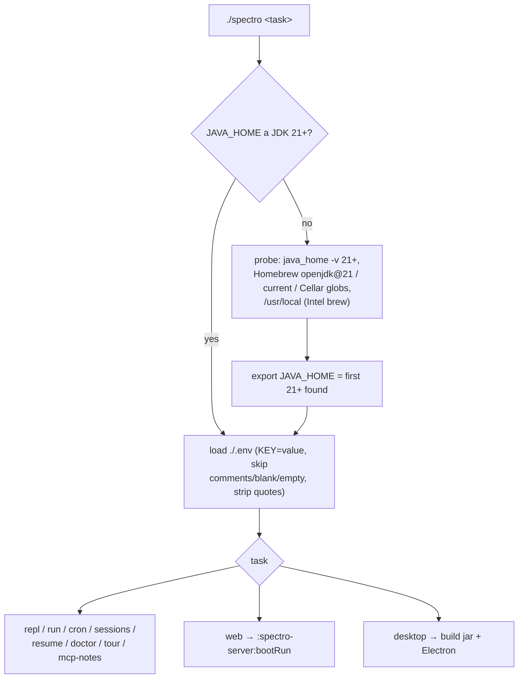

# spectroscope — architecture

How the harness fits together: one headless core, its faces, a narrow
provider port, a layered config, and a launcher that makes it all start with one
word. This document covers the **backend + launcher + desktop**; the browser
front end (design system, Lab) has its own doc → [WEB-UI.md](WEB-UI.md).

> The wire format never changes. Everything below is additive over the
> JSONL `RunEvent` stream
> ([../../docs/concept/JSONL-FORMAT.md](../../docs/concept/JSONL-FORMAT.md)).

---

## 1. One core, many faces

The guiding idea: the core is a container-free Java library that
produces a **typed `RunEvent` stream**. Every face is just a renderer of that
stream. The same stream is simultaneously the UI protocol, the storage format
(JSONL) and the data source for the graph and the Lab.



Modules (Gradle multi-project):

| module | role | key types |
|---|---|---|
| `spectro-core` | the headless library | `Agent`, `EventStream`, `CancelSignal`, `LlmProvider`, `ToolRegistry`, `PermissionBroker`, `SessionStore`, `CronScheduler`, `TracingPort` |
| `spectro-cli` | terminal face | `SpectroCli` (picocli), `Tour`, `DoctorCommand`, `TracingProvider` |
| `spectro-server` | web backend | `SpectroSocketHandler`, `SessionConnection`, REST controllers |
| `spectro-web` | browser UI | React + Vite; built into the server jar's `static/` |
| `spectro-desktop` | desktop shell | Electron `main.ts` that manages the JVM |
| `spectro-mcp-notes` | bundled example MCP server | stdio server exposing `search_notes` / `add_note` |
| `spectro-orchestrator` | the fleet | `OrchestratorPanel`, `BusEnvelope`, `InMemoryBus`, `BusPublisher` — lanes as full core agents on a shared bus, one merged stream |

---

## 2. The provider port and the runtime switch

Everything the loop needs from a model sits behind one interface — swap the
implementation, the loop never notices:

```java
public interface LlmProvider {
    Iterable<ProviderEvent> stream(ProviderRequest request);
    default String providerName() { return null; } // live label, see below
}
```

Three implementations: `anthropic` (official SDK), `ollama` (Spring `RestClient`
+ a declarative `@GetExchange` probe), `openai` (any OpenAI-compatible server).
`ProviderFactory.providerFromConfig()` builds the right one from the effective
config; a missing Anthropic key throws (the caller reports it, the core never
`System.exit`s).

**In-app switching (`SwitchableProvider`).** The web UI's provider picker can
change backend mid-session. Because the agent is built **once per connection**
(it carries the multi-turn history, and the spawn tools reference exactly its
`SubagentManager`), the switch cannot rebuild the agent. Instead the agent holds
a `SwitchableProvider` — an `AtomicReference<LlmProvider>` that `stream()`
delegates to. `set_provider` swaps the delegate; the change takes effect on the
next prompt, history intact. `providerName()` lets `run_start` report the live
provider, so the JSONL stays accurate without a new event type.



---

## 3. Configuration: layers, `.env`, and the launcher

### Precedence

Low to high — later layers win field by field. **The environment sits directly
above the defaults; every settings file outranks it** (owner decision
2026-07-18, "settings-productization" — *"die env ist die Basis, die Settings
geben den Ton an"*: env is the base, settings call the shots):



The env layer is normally fed by the gitignored `./.env` — it now seeds the BASE
configuration (bootstrap, CI, one-shot experiments), but any settings file wins
over it; `spectro doctor` names every `SPECTRO_*` variable that is set but shadowed
by a settings field, and `.env.example` names the field each one defers to.

**Two resolution moments.** Config resolves at two different times. The
*process* moment (server boot, `spectro doctor`, CLI startup) has no session yet,
so only `defaults < env < user < launch-dir < flags` applies — this is where
`workspace` itself and the one-per-process `logLevel` resolve (a workspace
scope rejects both, loudly: a folder must not repoint the agent elsewhere or
hijack process-wide logging). The *session* moment (the agent build, the
composer gear, a per-connection re-apply) joins the session's own resolved
workspace pair — project, then local — directly below launch-dir: two
concurrent sessions with different workspaces can legitimately run different
providers or permission modes.

**The settings API.** `GET /api/settings[?session=]` returns the resolved
configuration alongside per-field provenance (which layer won, which lower
layers were shadowed) and the raw non-empty layers — without `?session=` it is
the process-moment view, with one the session-relative view. `PUT
/api/settings/{user|project|local}` writes a schema-validated partial patch to
one scope (a `null` value removes that key; secret-shaped keys —
`*_API_KEY`/`*_TOKEN` — are always rejected). The header gear writes the user
scope; a second gear in the composer row writes the session's workspace pair
(permission mode, always-allow rules, local overrides, `mcpServers`/`hooks`).

### The `./spectro` launcher

One executable per checkout dispatches the spectro tasks (not the raw Gradle task
zoo) and, crucially, **fixes two host problems before any command runs**:



Why this matters: the build targets Java 21 (`--release 21`), but a machine's
default `java` is often older (e.g. 17). Gradle then fails with *"release version
21 not supported."* The launcher resolves any installed JDK **≥ 21** (verified up
to 26) and exports `JAVA_HOME`, preferring the stable versioned keg
(`openjdk@21`) so a Homebrew upgrade of the floating formula can't strand it. It
also loads `./.env` for **every** face — including `desktop`, which spawns the jar
through Electron and so bypasses Gradle's own `.env` injection.

---

## 4. The desktop face: process management

A JVM cannot live inside Electron's main process, so the shell **supervises** an
external boot jar — the work here is lifecycle and packaging.

```mermaid
sequenceDiagram
    participant L as ./spectro desktop
    participant E as Electron main.ts
    participant JVM as spectro-server.jar
    participant Win as BrowserWindow

    L->>L: stop any running instance (single-instance lock)
    L->>L: gradlew :spectro-server:bootJar
    L->>E: npm start (env: JAVA_HOME/bin on PATH)
    E->>E: findFreePort()
    E->>JVM: spawn("java", ["-jar", jar, "--server.port=P"])
    loop up to 30 s
        E->>JVM: GET /api/health
    end
    JVM-->>E: 200 {"status":"ok"}
    E->>Win: loadURL(127.0.0.1:P)  %% title becomes "spectroscope"
    Note over E,JVM: tray keeps app + server alive on window close<br/>(cron keeps running); ⌘Q / tray→Quit does SIGTERM→SIGKILL
```

Two gotchas the launcher now handles for you:

- **Single-instance lock.** Electron allows one instance; a relaunch after a
  rebuild would otherwise hand off to the *old* running build (blank / stale
  window). `./spectro desktop` stops any running instance first, so a relaunch
  always brings up the current build.
- **Fresh Electron binaries carry the macOS quarantine flag.** On first `npm
  install` the launcher clears `com.apple.quarantine` so Gatekeeper doesn't block
  startup.

---

## 5. Where things live at runtime

```
~/.spectro/
├── settings.json        # user config layer (config.json read beneath it, one release)
├── sessions/            # one JSONL file per run + blob subfolders (attachments)
├── images/              # content-addressed generated images <sha256>.<ext>
├── skills/              # SKILL.md packages (user scope)
└── jobs.json            # cron schedule
<project>/.spectro/
├── settings.json        # project config layer (checked in)
├── settings.local.json  # machine-local overrides (gitignored)
└── skills/              # project-scoped skills (win over user scope)
```

See also: [WEB-UI.md](WEB-UI.md) (front end + Lab) ·
[../README.md](../README.md) (run it) ·
[../../docs/design/BUILD-PLAN.md](../../docs/design/BUILD-PLAN.md) (canonical contracts).
