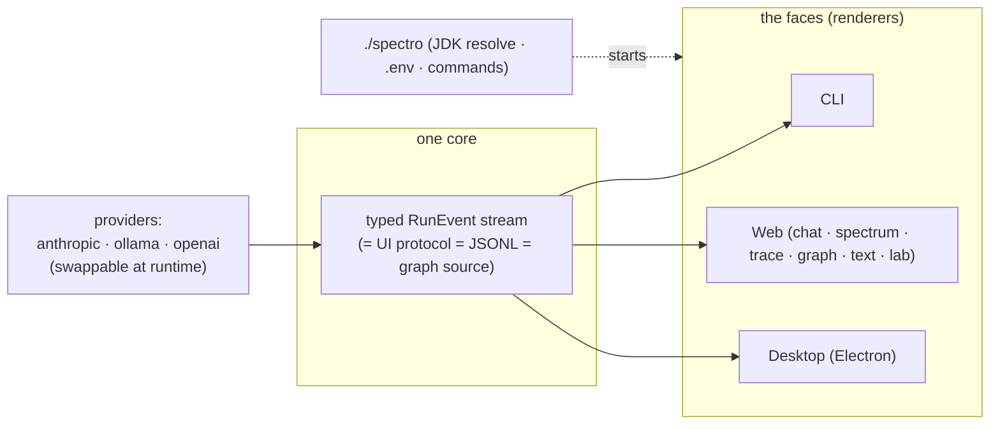

# spectro/docs — architecture reference

Documentation for the build under `spectro/` — the complete harness. The .md
docs use Mermaid diagrams (render on GitHub and in most editors); the
`diagrams/` dossier is generated SVG.

| doc | what it covers |
|---|---|
| [USER-GUIDE.html](USER-GUIDE.html) / [USER-GUIDE.pdf](USER-GUIDE.pdf) (dark) · [USER-GUIDE-LIGHT.html](USER-GUIDE-LIGHT.html) / [USER-GUIDE-LIGHT.pdf](USER-GUIDE-LIGHT.pdf) (light) | the **complete English user guide + technical reference** (120 pages, both brand themes): every feature of every face with real screenshots, the file-system map, and the full wire-level reference (events, WS/REST protocols, config keys). Generated — rebuild with `guide-assets/build_user_guide.py` (see Appendix B inside) |
| [ARCHITECTURE.md](ARCHITECTURE.md) | one core and its faces, the provider port + runtime switch (`SwitchableProvider`), the config hierarchy, the `./spectro` launcher (JDK resolution + `.env`), and desktop process management |
| [WEB-UI.md](WEB-UI.md) | the browser front end: the state pipeline, the design system (skins = *genome*, effects = *shaders*), the provider picker, and the immersive **Lab** (step-through replay) |
| [diagrams/](diagrams/README.md) | the **generated SVG architecture dossier**: 15 designed diagrams (overview, modules, event protocol, providers, loop, tools, subagents, server, web, runtime, MCP, treemap, wall poster, protocol breakdown, orchestrator fleet) in the brand design language (espresso dark + paper light variants), each from a rerunnable `build_NN_*.py` |

Canonical references live one level up:

- [../README.md](../README.md) — how to run the build, what ships
- [../../docs/concept/JSONL-FORMAT.md](../../docs/concept/JSONL-FORMAT.md) — the wire format (binding)
- [../../docs/design/BUILD-PLAN.md](../../docs/design/BUILD-PLAN.md) — canonical Java contracts
- [../../docs/concept/ARCHITECTURE.md](../../docs/concept/ARCHITECTURE.md) — the engine-room flows, historically grown

## The mental model in one picture

