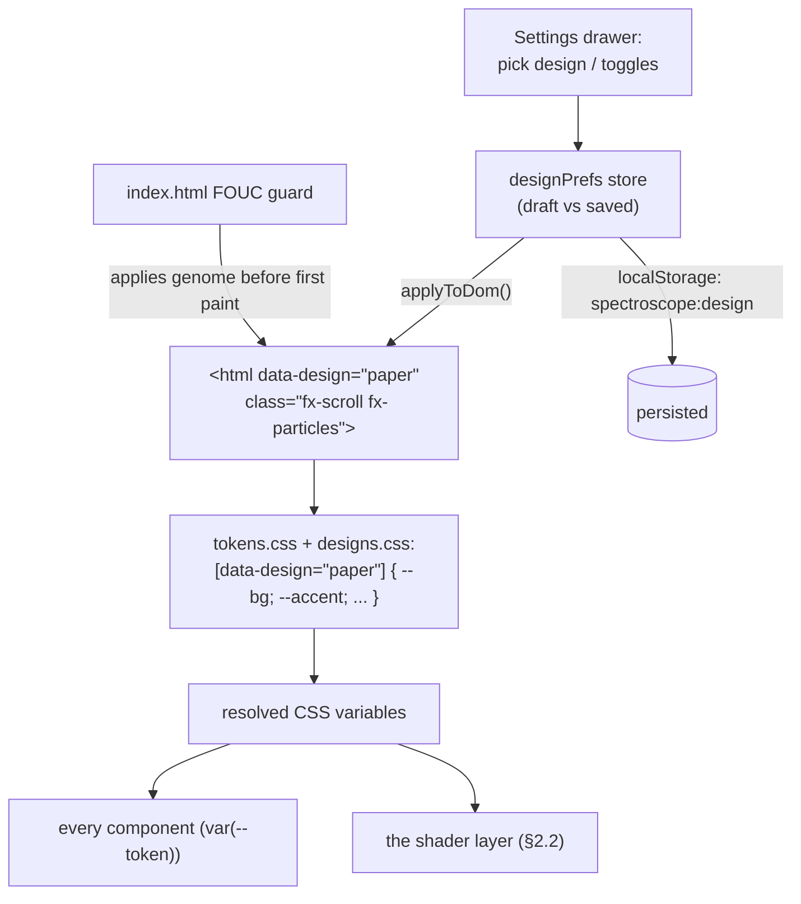
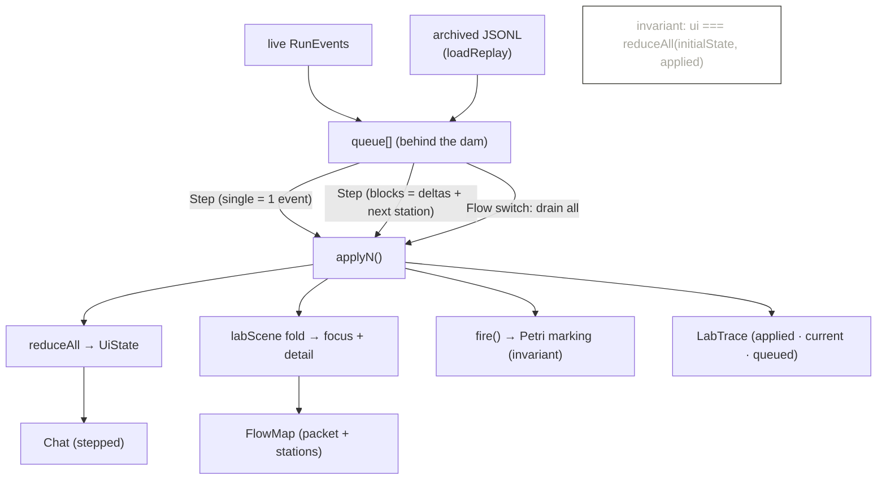

# spectroscope — the web UI (front-end architecture)

The browser face is a plain React + Vite app, built into the server jar's
`static/` folder so one jar serves everything. It talks to `spectro-server` over
one WebSocket (RunEvents in) and a few REST endpoints. This doc covers the
**state pipeline**, the **design system** (skins and effects — the *genome* and
the *shaders*), the **provider picker**, and the immersive **Lab** tab.

Backend, launcher and desktop → [ARCHITECTURE.md](ARCHITECTURE.md).

---

## 1. The state pipeline — one stream, many lenses

Every event arrives on the socket, is batched once per animation frame (against
the `text_delta` flood), and folded by **one pure reducer** into an immutable
`UiState`. Every tab — chat, spectrum, trace, graph, text, lab — is just a
different reader of that same state: not separate data paths, lenses.

```mermaid
flowchart LR
    ws["WebSocket<br/>(RunEvent JSON)"] -->|"rAF batch"| onEvents["App.onEvents(batch)"]
    onEvents --> reducer["reduceAll(state, batch)<br/>(pure, src/state/reducer.ts)"]
    onEvents --> raw["liveEvents[]<br/>(raw, for graph)"]
    onEvents --> dam["stepper.pushLive(batch)<br/>(the Lab's dam)"]
    reducer --> ui["UiState<br/>(turns, cards, trace, context, images, ...)"]

    ui --> chat["Chat"]
    ui --> ring["ContextRing"]
    ui --> trace["TraceView"]
    ui --> spectrum["SpectrumView<br/>(fleet lanes)"]
    raw --> graph["GraphView<br/>(React Flow + dagre)"]
    dam --> lab["LabView<br/>(stepped state)"]

    classDef pure fill:#1c1c19,stroke:#82fecb,color:#F5F4EF
    class reducer pure
```

Because the reducer is pure, a **replayed archive** and the **live socket** are
the exact same `UiState` shape from the exact same code — the app only chooses
which of the two the components render. That is also why the Lab can step an old
JSONL file for free (§4). The UI chrome is bilingual (en default, de via the
header toggle, `src/i18n/i18n.ts`); chat content always keeps its own language.

---

## 2. The design system — genome and shaders

The whole UI reads its colours, fonts, radii and shadows through CSS custom
properties (`var(--token)`, master in `src/tokens.css`). That single indirection
makes two things cheap: swapping the entire look, and painting effects that
always match.

### 2.1 Genome — a skin is a token override set

Think of each skin as a **genome**: a small, self-contained set of token values
that *is* the design's DNA. Nothing structural changes — only the genome.
Selecting a skin flips one attribute on `<html>`; because every rule reads
`var(--token)`, the whole UI re-expresses itself instantly, no reload.



Three brand designs ship:

| picker name | id | genome | lives in |
|---|---|---|---|
| `spectro dark` | (default, `:root`) | espresso `#17120D`, amber accent | `tokens.css` |
| `spectro bright` | `paper` | paper light, darkened-blue accent | `tokens.css` |
| `spectro white` | `still` | deliberately quiet all-white, one blue | `designs.css` |

`designs.css` holds the one extra skin plus the effect CSS; the seven earlier
experimental skins were retired on 2026-07-20 (owner call) — git history keeps
them, and a stored retired id falls back to the default without breaking
saved prefs.

**Draft vs saved.** The `designPrefs` store keeps two layers: changes apply
**live** (you see them behind the drawer) as the *draft*; **Save** commits the
draft to `localStorage`; **Revert** throws the draft away and restores the last
saved genome. Injectable seams keep the store unit-testable in plain Node.

### 2.2 Shaders — the effect layer reads the active genome

The **shader** layer is the visual motion painted *on top of* the genome. It
reads the active skin's colours straight from the resolved CSS variables, so it
recolours automatically when the genome changes.

- **Particle shader** (`ParticleField.tsx`): a fixed, `z-index:-1` `<canvas>`
  portaled to `<body>` (above the background, behind the UI). One signature
  remains — the brand **dust** (slow drifting specks). It reads the active
  design's variables live, is static under `prefers-reduced-motion`, pauses on
  `visibilitychange`, and seeds lazily on the first real viewport size.
  `spectro white` deliberately renders nothing.
- **Scroll shader** (`scrollReveal.ts` + `designs.css`): under `html.fx-scroll`,
  `[data-reveal]` blocks fade/rise in via an `IntersectionObserver` (a
  `MutationObserver` catches panels mounted on tab switches, so nothing stays
  stuck hidden). Plus `scroll-behavior: smooth`.

Both are toggled independently by root classes (`fx-particles`, `fx-scroll`) and
both defer to reduced-motion.

---

## 3. The provider picker

The connection chip in the header is a button → a popover with a provider
`<select>` (anthropic / ollama / openai) and an editable model field. Applying
sends `set_provider`; the chip updates optimistically and the next `run_start`
confirms it. The server-side mechanism (the `SwitchableProvider` indirection,
key-checking, refusal on a missing key) lives in
[ARCHITECTURE.md §2](ARCHITECTURE.md#2-the-provider-port-and-the-runtime-switch).

---

## 4. The Lab — step-through replay on the Flow map

The Lab makes the agent loop *tangible*: your functional chat on the left, the
**Flow map** in the middle, and the **JSONL strip** on the right — all three
rendering the same *stepped* state. Events don't flow through automatically;
they queue behind a client-side **dam**, and you step through them one by one
and watch the packet move, the chat grow and the trace advance in lockstep.

### 4.1 The dam (`stepper.ts`)

An external store (same pattern as `designPrefs`). Live events keep queueing
even while the Lab is unmounted. A step applies the next event(s) through the
**same pure reducer** the chat uses, plus the two pure lab folds (§4.2).



Grain is switchable: **single** = exactly one JSONL line per click; **blocks** =
a meaningful group (one thinking run, one answer, one station event) in one
click. The **Flow** switch opens the dam — everything races through live.

### 4.2 The two pure folds (`labScene.ts`, `petriModel.ts`)

- `labScene` is the scene model the map paints: a DOM-free fold over RunEvents
  that tracks WHICH element each agent's packet is on right now (`focus`) plus
  the detail — disk read/write, gate state, the exact tool, and (pulled from
  the event input) the file, shell command and MCP call.
- `petriModel` survives as the stepper's **formal invariant**: places/
  transitions with guards, and `log` as an accumulator place whose marking
  equals the JSONL line number. The net literally counts the session file —
  the stepper folds it on every step even though no net is rendered anymore.

Both are unit-tested (`labScene.test.ts` — 29 cases, `petriModel.test.ts` — 7,
`stepper.test.ts` — 15, `sceneToFlow.test.ts` — 7).

### 4.3 Rendering (`FlowMap.tsx`, `LabTrace.tsx`, `LabView.tsx`)

- `FlowMap` renders the scene as a React Flow canvas (`sceneToFlow.ts` maps
  scene → nodes/edges, pure; the render pieces live in `lab/flowmap/`). It
  reskins with every design because nodes and edges read the token variables.
- `LabTrace` shows applied lines, the just-fired line highlighted, a **dam
  divider**, then the dimmed queue; each row expands to the full event via the
  shared `JsonTree`.
- Permissions surface **when you step onto the request** — meanwhile the server
  genuinely waits on the permission future, so the packet sitting at the gate
  is the real system state, not a simulation. While the Lab is active it owns
  the dialog; App suppresses the global one.

Live **and** archive: opening a stored session from the sidebar steps that
replay through the map (composer read-only); the live run steps as it arrives.

---

## 5. File map (the lab + design slice)

```
spectro-web/
├── index.html                 # Vite root + FOUC guard (applies the saved design first)
└── src/
    ├── tokens.css             # token master (brand dark + paper light)
    ├── designs.css            # the `still` skin + effect CSS
    ├── i18n/i18n.ts           # en/de chrome dictionary (en default)
    ├── state/
    │   ├── designPrefs.ts (+test) # design/effect store (draft vs saved)
    │   ├── stepper.ts     (+test) # the Lab's event dam
    │   └── lang.ts        (+test) # chrome language store
    ├── effects/scrollReveal.ts    # scroll shader hook
    ├── components/
    │   ├── ParticleField.tsx      # dust shader (canvas, token-colored)
    │   ├── SettingsPanel.tsx      # the design drawer + settings page
    │   └── ProviderPicker.tsx     # header provider popover
    ├── spectrum/SpectrumView.tsx  # fleet lanes (the Spectrum tab)
    └── lab/
        ├── labScene.ts   (+test)  # pure event → scene (focus + detail)
        ├── petriModel.ts (+test)  # pure event → Petri marking (invariant)
        ├── sceneToFlow.ts(+test)  # scene → React Flow nodes/edges (in flowmap/)
        ├── FlowMap.tsx            # the map canvas (React Flow)
        ├── LabControls.tsx        # step/flow/grain controls
        ├── LabTrace.tsx           # the JSONL strip
        ├── LabView.tsx            # 3-column layout
        └── flowmap/               # nodes, edges, glyphs, css
```
